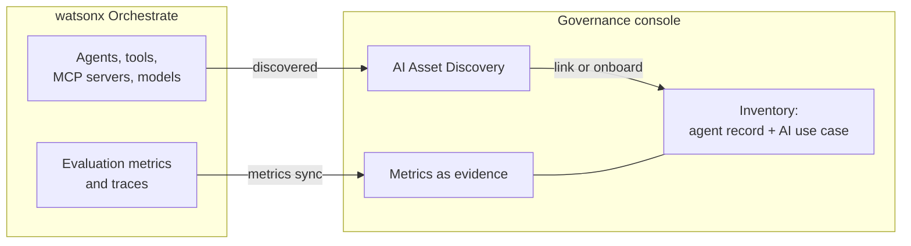

# Agentic: governing watsonx Orchestrate agents in the Governance console

[Back to the main README](../README.md)

This module adds governance to an agent that already exists. It does not contain agent code. The agent is the investment committee demo in a separate repository:

**[investment-agent-with-control-plane](https://github.ibm.com/nicole-nair/investment-agent-with-control-plane)**

That repository deploys three agents to watsonx Orchestrate:

| Agent | Kind | Role |
|-------|------|------|
| `investment_committee_coordinator` | Native, supervisor | Routes requests and assembles the investment committee brief |
| `portfolio_monitor` | Native | Fetches financial data through an MCP toolkit |
| `chart_generation_agent` | External (A2A) | LangGraph agent on IBM Code Engine that generates charts |

This module connects those agents to the watsonx.governance Governance console in two ways:

1. **AI Asset Discovery** finds the agents and brings them into the inventory.
2. **Metrics sync** pulls their evaluation metrics from Orchestrate into the Governance console as evidence.



## Prerequisites

- The agents are deployed. Follow the README in the agent repository first.
- A watsonx.governance instance with the Governance console, and permission to administer it.
- AI Asset Discovery and the Orchestrate integration are available on your instance. Both features were announced in mid-2026; check availability for your hosting option (IBM Cloud, AWS or software) before you plan a demo around them.
- An API key for the Orchestrate instance.

## Step 1: Deploy the agents

```bash
git clone https://github.ibm.com/nicole-nair/investment-agent-with-control-plane.git
cd investment-agent-with-control-plane
cp .env.template .env      # fill in
source .env
cd config && ./deploy-all.sh
```

The script also configures the external chart agent to export its traces to Orchestrate over OpenTelemetry, so that all three agents have traces and metrics under **Analyze**. Without this, the external agent has nothing to sync.

Send a few messages to the coordinator so that there is activity to evaluate. For example:

```
Latest financial data for CIMB Group & Maybank?
Generate charts for the EBITDA and Revenue for the two banks
```

## Step 2: Connect Orchestrate to watsonx.governance

Create the connection between the Orchestrate instance and watsonx.governance. This one connection is used by both discovery and metrics sync.

The steps differ by hosting option and release, so follow the product documentation for your instance:

- [Enforcement Tracking for watsonx Orchestrate](https://www.ibm.com/new/announcements/from-governance-policies-to-governance-proof-with-enforcement-tracking-for-watsonx-orchestrate)
- [AI Asset Discovery in watsonx.governance](https://www.ibm.com/new/announcements/ai-asset-discovery-in-watsonx-governance)

## Step 3: Discover and onboard the agents

1. In the Governance console, open AI Asset Discovery and run discovery against the Orchestrate connection.
2. Check that the three agents are listed. For each one, discovery captures its name and description, version and environment, tools and MCP servers, foundation model, and collaborator agents.
3. Discovery suggests whether each agent matches a record that is already in the inventory. For each agent, either link it to the existing record or onboard it as a new one. A person makes this decision; it is not automatic.
4. Associate the coordinator agent with an AI use case. Onboarding starts the workflows configured for that use case, such as risk assessment and approval.

Discovery only sees platforms that are connected. It will not find agents that run elsewhere.

## Step 4: Verify

- **In Orchestrate**: under Analyze, each agent shows conversations, traces and evaluation metrics.
- **In the Governance console**: the agent's record is linked to its AI use case, and the synced metrics appear against it with their thresholds.

Metrics sync records evidence. It does not stop an agent at runtime. Runtime controls stay in Orchestrate, such as the `pre_message_sanitizer` guardrail plugin on the coordinator.

## Troubleshooting

| Problem | Check |
|---------|-------|
| Agents are not listed in discovery | The connection points at the right Orchestrate instance and environment, and discovery has been run since the agents were deployed |
| No metrics for the chart agent | The `WXO_OTEL_EXPORT_URL` and `WXO_AGENT_ID` variables are set on the Code Engine app, and its log shows `[wxo-trace] exporting traces` |
| No metrics for any agent | Monitoring is enabled for the agent, the agent is in the live environment, and at least one scheduled sync has run since the last conversation |
| 401 from the Orchestrate API | The bearer token has expired; request a new one |
